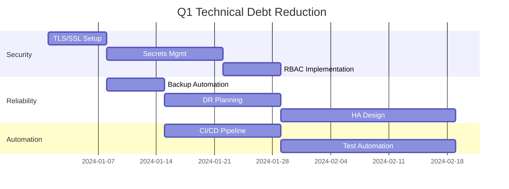

# 📉 PHÂN TÍCH NỢ KỸ THUẬT (TECHNICAL DEBT)

## 📊 Tổng Quan Technical Debt

### Debt Score: 6.5/10 (Trung bình - Cần cải thiện)

| Category | Score | Impact | Effort | Priority |
|----------|--------|---------|---------|-----------|
| Security | 5/10 | High | Medium | 🔴 Critical |
| Scalability | 6/10 | High | High | 🟠 High |
| Maintainability | 7/10 | Medium | Low | 🟡 Medium |
| Performance | 7/10 | Medium | Medium | 🟡 Medium |
| Documentation | 8/10 | Low | Low | 🟢 Low |

---

## 🔴 Critical Issues (Fix trong 1-2 tuần)

### 1. Security Debt
```yaml
Issue: Plaintext secrets in environment
Impact: High - Security breach risk
Effort: 2-3 days
Solution:
  - Implement HashiCorp Vault hoặc Docker Secrets
  - Enable TLS/SSL cho tất cả endpoints
  - Implement RBAC với OAuth2/OIDC
```

### 2. No Disaster Recovery
```yaml
Issue: Không có DR plan và testing
Impact: Critical - Data loss risk
Effort: 1 week
Solution:
  - Implement automated backup với retention
  - Document và test restore procedures
  - Setup off-site backup replication
```

---

## 🟠 High Priority (Fix trong 1 tháng)

### 1. Lack of High Availability
```yaml
Issue: Single point of failure cho tất cả services
Impact: High - Downtime risk
Effort: 2-3 weeks
Solution:
  - Prometheus federation hoặc Thanos
  - Grafana clustering
  - Database replication
  - Load balancer setup
```

### 2. No CI/CD Pipeline
```yaml
Issue: Manual deployment process
Impact: Medium - Human error risk
Effort: 1 week
Solution:
  - GitHub Actions/GitLab CI setup
  - Automated testing
  - Container scanning
  - GitOps deployment
```

### 3. Limited Monitoring Coverage
```yaml
Issue: No self-monitoring
Impact: Medium - Blind spots
Effort: 3-4 days
Solution:
  - Meta-monitoring setup
  - Service health dashboards
  - SLI/SLO implementation
```

---

## 🟡 Medium Priority (Fix trong 2-3 tháng)

### 1. Performance Optimization Needed
```yaml
Issue: No caching, query optimization
Impact: Medium - Slow dashboards
Effort: 1-2 weeks
Solution:
  - Implement Redis caching
  - Query optimization
  - Index optimization
  - Resource tuning
```

### 2. Limited Scalability
```yaml
Issue: Vertical scaling only
Impact: Medium - Growth limitations
Effort: 2-3 weeks
Solution:
  - Horizontal scaling design
  - Sharding strategy
  - Queue implementation
  - Microservices refactoring
```

### 3. Basic Alerting Only
```yaml
Issue: Simple threshold alerts
Impact: Medium - Alert fatigue
Effort: 1 week
Solution:
  - ML-based anomaly detection
  - Alert correlation
  - Intelligent routing
  - Escalation policies
```

---

## 🟢 Low Priority (Continuous Improvement)

### 1. Documentation Gaps
```yaml
Issue: Missing runbooks, architecture docs
Impact: Low - Onboarding delays
Effort: Ongoing
Solution:
  - Architecture diagrams
  - Runbook templates
  - Video tutorials
  - Knowledge base
```

### 2. Testing Coverage
```yaml
Issue: No automated tests
Impact: Low - Quality assurance
Effort: Ongoing
Solution:
  - Unit tests
  - Integration tests
  - Load tests
  - Chaos engineering
```

---

## 💰 Cost của Technical Debt

### Current Costs
- **Operational**: ~20 hours/month cho manual tasks
- **Incident Response**: ~5-10 hours/incident
- **Security Risk**: Potential breach cost
- **Downtime**: ~$1000/hour (estimated)

### ROI của Fixes
| Fix | Cost | Benefit | ROI Period |
|-----|-------|----------|------------|
| CI/CD | 40 hours | Save 20h/month | 2 months |
| HA Setup | 80 hours | Prevent downtime | 3-6 months |
| Security | 60 hours | Risk mitigation | Immediate |
| Automation | 40 hours | Save 15h/month | 3 months |

---

## 📈 Debt Reduction Roadmap

### Quarter 1 (Tháng 1-3)


### Quarter 2 (Tháng 4-6)
- Kubernetes migration
- Service mesh implementation
- Advanced monitoring features
- Performance optimization

### Quarter 3 (Tháng 7-9)
- Multi-tenancy support
- Cost optimization
- Compliance automation
- Advanced analytics

---

## 🎯 Success Metrics

### Technical Metrics
- **Code Coverage**: Target > 80%
- **Deployment Frequency**: > 1/day
- **MTTR**: < 15 minutes
- **Security Score**: > 8/10

### Business Metrics
- **Operational Cost**: -30%
- **Incident Count**: -50%
- **Team Velocity**: +40%
- **Customer Satisfaction**: +20%

---

## 🛠️ Quick Wins (Có thể làm ngay)

1. **Enable Container Health Checks** (2 hours)
```yaml
healthcheck:
  test: ["CMD", "curl", "-f", "http://localhost/health"]
  interval: 30s
  retries: 3
```

2. **Add Resource Limits** (1 hour)
```yaml
deploy:
  resources:
    limits:
      memory: 2g
      cpus: '2'
```

3. **Setup Log Rotation** (30 minutes)
```yaml
logging:
  driver: json-file
  options:
    max-size: "10m"
    max-file: "3"
```

4. **Create Backup Cron** (1 hour)
```bash
# Add to crontab
0 2 * * * /path/to/scripts/backup.sh
```

5. **Generate Strong Passwords** (15 minutes)
```bash
openssl rand -base64 32  # For each service
```

---

## 📋 Action Items Checklist

### Immediate (This Week)
- [ ] Security audit với `docker scan`
- [ ] Update tất cả base images
- [ ] Enable HTTPS cho Grafana
- [ ] Setup backup cron job
- [ ] Document current architecture

### Short-term (This Month)
- [ ] Implement CI/CD pipeline
- [ ] Setup monitoring alerts
- [ ] Create runbooks
- [ ] Performance baseline
- [ ] Security scanning automation

### Long-term (This Quarter)
- [ ] HA implementation
- [ ] Kubernetes migration planning
- [ ] Cost optimization strategy
- [ ] Compliance roadmap
- [ ] Team training plan

---

## 💡 Recommendations

1. **Start Small**: Focus on security and backup first
2. **Automate Early**: CI/CD saves time immediately
3. **Measure Impact**: Track metrics before/after changes
4. **Document Everything**: Future you will thank you
5. **Iterate Quickly**: Small improvements > perfect solutions

---

*Technical Debt Review Date: December 2024*  
*Next Review: March 2025*  
*Owner: DevOps Team*